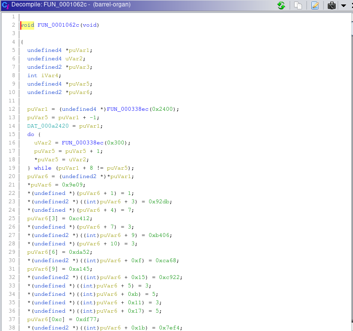
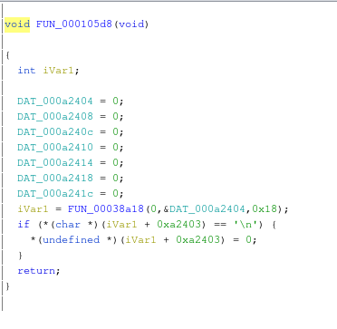
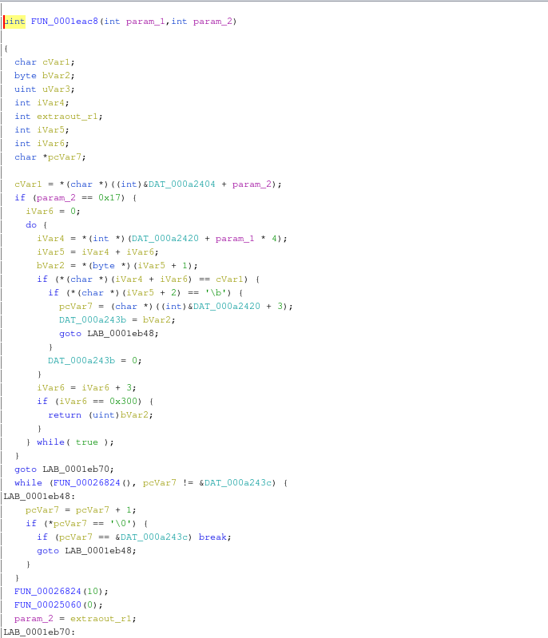
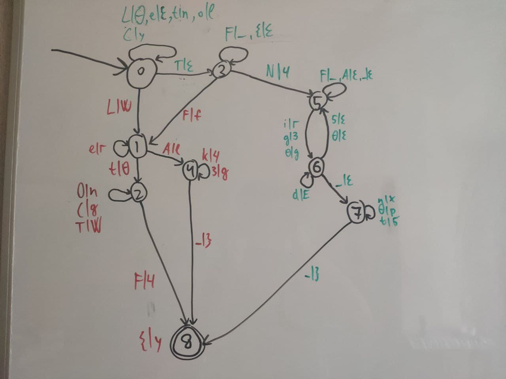

# LetoCTF Taskbot 2021 | barrel-organ

Автор: [1MiKHalyCH1](https://github.com/1MiKHalyCH1)

## Описание

> У меня есть шарманка. Я её дам.
>
> Чтобы заработала шарманка, нужно знать ш...а... . Его я не дам.

## Файлы

- [barrel-organ.zip](static/barrel-organ.zip)

## Решение 

Как становится понятно по `file barrel-organ`, нам выдан пострипанный бинарь под ARM с прилинкованными библиотеками. Скормим его гидре.

Находим `main` по строчке `"Give me flag prefix:"`:
```
undefined4 FUN_00010420(void)

{
  FUN_0001062c(DAT_000a2420);
  FUN_0002660c("Give me flag prefix:");
  FUN_000105d8();
  _DAT_000a2424 = 0;
  DAT_000a2428 = 0;
  DAT_000a242c = 0;
  DAT_000a2430 = 0;
  DAT_000a2434 = 0;
  _DAT_000a2438 = 0;
  DAT_000a243c = 0;
  FUN_0001eac8(0,0);
  return 0;
}
```

Рассмотрим `FUN_0001062c`:



По коду видим:
- выделяем 0x2400 байт в `DAT_000a2420` (`FUN_000338ec` - это `malloc`)
- в нём выделяем массивы по 0x300 байт
- инициализируем их по порядку 3-байтовыми структурами (0x300/3 = 256 в каждом подмассиве)

Итого имеем после выполнения этой ф-ии двумерный массив `DAT_000a2420[8][256]` 3-байтовых структур (будем называть его массивом узлов). Сдампить его можно либо аккуратно попарсив вывод гидры, либо поставить брейкпойнт в gdb после этой ф-ии и прочитав кусок памяти. Кому как проще)

Далее `FUN_000105d8`:



Тут просто читаем в `DAT_000a2404` 24 байта. Как станет чуть позже, это префикс флага.

Далее основная ф-ия `FUN_0001eac8`:



Эта ф-ия рекурсивная. Рассмотрим, что в ней происходит.

Рассмотрим части ф-ии:
```
  cVar1 = *(char *)((int)&DAT_000a2404 + param_2);
  if (param_2 == 0x17) {
    iVar6 = 0;
    do {
      iVar4 = *(int *)(DAT_000a2420 + param_1 * 4);
      iVar5 = iVar4 + iVar6;
      bVar2 = *(byte *)(iVar5 + 1);
      if (*(char *)(iVar4 + iVar6) == cVar1) {
        if (*(char *)(iVar5 + 2) == '\b') {
          pcVar7 = (char *)((int)&DAT_000a2420 + 3);
          DAT_000a243b = bVar2;
          goto LAB_0001eb48;
        }
        DAT_000a243b = 0;
      }
      iVar6 = iVar6 + 3;
      if (iVar6 == 0x300) {
        return (uint)bVar2;
      }
    } while( true );
  }
  goto LAB_0001eb70;
```

и

```
  iVar6 = 0;
  do {
    iVar4 = *(int *)(DAT_000a2420 + param_1 * 4);
    iVar5 = iVar4 + iVar6;
    uVar3 = (uint)*(byte *)(iVar5 + 2);
    if (*(char *)(iVar4 + iVar6) == cVar1) {
      (&DAT_000a2424)[param_2] = *(undefined *)(iVar5 + 1);
      uVar3 = FUN_0001eac8(uVar3,param_2 + 1);
      (&DAT_000a2424)[param_2] = 0;
    }
    iVar6 = iVar6 + 3;
  } while (iVar6 != 0x300);
```

Тут мы берём `i`-ый символ префикса флага (`i` - `param_2` нашей ф-ии) в `cVar1`. В `iVar5` мы перебираем узлы из `DAT_000a2420[param_1]`. Тут становится понятно, какие аргументы у рекурсивной ф-ии.

При переборе узлов сравниваем первое поле с текущим символом префикса флага. В `uVar3` кладём третье поле узла, а второе поле кладём в выделенный массив по текущеу индексу флага (это и есть постфикс флага).

Если это уже последний символ префикса флага (первая часть кода) и `uVar3 == 8`, то идём печатать постфикс флага. Иначе, вызываем ф-ию с параметрами `uVar3` и увеличиваем индекс на 1.

Часть, которая печатает флаг (пропуская `0`-байты):

```
  while (FUN_00026824(), pcVar7 != &DAT_000a243c) {
LAB_0001eb48:
    pcVar7 = pcVar7 + 1;
    if (*pcVar7 == '\0') {
      if (pcVar7 == &DAT_000a243c) break;
      goto LAB_0001eb48;
    }
  }
```

Из логки работы этой ф-ии (и подсказки в описании таска `шАРМаНКА`) можно понять, что тут реализован [НКА](https://ru.wikipedia.org/wiki/Недетерминированный_конечный_автомат). И наша структура - узел НКА в виде `{символ_на_вход, символ_на_выход, следующий_стейт}`. 

`DAT_000a2420` - таблица таких узлов: `DAT_000a2420[текущий_стейт] = список_возможных_переходов`.

Первым делом [отсекаем из стейтов](filter_states.py) все мусорные. Т.е. оставляем только печатаемые символы и 0 (пустые слова):
```
0 [['L', '0', 0], ['C', 'y', 0], ['e', 0, 0], ['L', 'W', 1], [0, 0, 0], ['o', 'l', 0], ['t', 'n', 0], ['T', 0, 3]]
1 [['e', 'r', 1], ['t', '0', 2], ['A', 'l', 4], [0, 0, 1]]
2 [['F', '4', 8], ['o', 'n', 2], ['T', 'W', 2], [0, 0, 2], ['C', 'g', 2]]
3 [['F', 'f', 1], ['N', '4', 5], ['F', '_', 3], ['{', 0, 3], [0, 0, 3]]
4 [['k', '4', 4], ['_', '}', 8], [0, 0, 4], ['3', 'g', 4]]
5 [['F', '_', 5], ['i', 'r', 6], ['0', 'g', 6], [0, 0, 5], ['g', '3', 6], ['A', 0, 5], ['_', 0, 5]]
6 [['0', 0, 5], [0, 0, 6], ['_', 0, 7], ['5', 0, 5], ['d', 'E', 6]]
7 [[0, 0, 7], ['0', 'p', 7], ['t', '5', 7], ['n', 'x', 7], ['_', '}', 8]]
8 [['{', 'y', 8], [0, 0, 8]]
```

Далее ищем строку длины 24, которую примет автомат. Тут либо пишем поиск в глубину по ориентрованному графу, либо рисуем граф и собираем руками (очевидно, что флаг должен быть читаемым):


Как видно на рисунке, тут есть пара фейковых флагов и один правильный.

## Флаг

```
LetoCTF{NFA_i5_g00d_n0t_0nly_4_r3gExp5}
```
