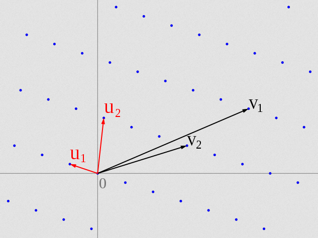
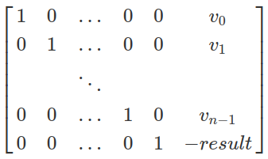
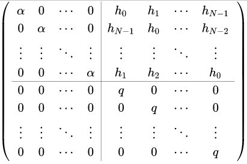

# LetoCTF Taskbot 2021 | scp-object

Автор: [keltecc](https://github.com/keltecc)

## Описание

> Короче, ███████, я тебя [ДАННЫЕ УДАЛЕНЫ] и в благородство играть не буду. Достанешь для меня флаг — и мы [ДАННЫЕ УДАЛЕНЫ].

## Файлы

- [scp-object.zip](static/scp-object.zip)

## Решение 

Нам выдаётся файл с кодом `challenge.sage` и его выходные данные `output.txt`. Рассмотрим подробнее, что делает код.

### 1. Сначала флаг и ключ шифрования читаются из файлов и передаются в функцию `encrypt()`, результат которой затем печатается:

```python
def main():
    flag = read_file('flag.txt')
    key = read_file('key.txt')

    result = encrypt(flag, key)

    print(result)
```

### 2. Сама функция `encrypt()` только разбивает входные данные на блоки. Можно сделать вывод, что шифр — блочный, размер блока указан выше:

```python
N = 16

def encrypt(plaintext, key):
    assert len(plaintext) == len(key)

    ciphertext = []

    for i in range(0, len(plaintext), N):
        plaintext_block = plaintext[i:i+N]
        key_block = key[i:i+N]
        ciphertext_block = encrypt_block(plaintext_block, key_block)
        ciphertext.append(ciphertext_block)

    return ciphertext
```

### 3. Смотрим в функцию `encrypt_block()`:

```python
def encrypt_block(plaintext, key):
    assert len(plaintext) == len(key) == N

    t = ceil(mean(plaintext + key)) ^ 3
    q = next_prime(t + randint(0, t))
    pol = construct_polynomial(q, plaintext, key)
    ciphertext = encrypt_polynomial(pol)

    return q, ciphertext
```

Сначала она вычисляет какие-то параметры `t` и `q`, а затем строит [многочлен](https://ru.wikipedia.org/wiki/%D0%9C%D0%BD%D0%BE%D0%B3%D0%BE%D1%87%D0%BB%D0%B5%D0%BD) на основе блоков флага и ключа. 

Здесь и далее используются специфичные для [SageMath](https://ru.wikipedia.org/wiki/Sage) объекты, но их суть может быть понятна из названия. Например, зная, что `plaintext` и `key` — блоки байтов длины `N`, можно понять, что `mean()` вычисляет [среднее арифметическое](https://ru.wikipedia.org/wiki/%D0%A1%D1%80%D0%B5%D0%B4%D0%BD%D0%B5%D0%B5_%D0%B0%D1%80%D0%B8%D1%84%D0%BC%D0%B5%D1%82%D0%B8%D1%87%D0%B5%D1%81%D0%BA%D0%BE%D0%B5) всех этих байтов, а `ceil()`, соответственно, округляет результат вверх. Полученное число `t` используется для вычисления `q` — [простого числа](https://ru.wikipedia.org/wiki/%D0%9F%D1%80%D0%BE%D1%81%D1%82%D0%BE%D0%B5_%D1%87%D0%B8%D1%81%D0%BB%D0%BE), чуть большего, чем `t`. Вероятно, это нужно, чтобы найти какое-либо простое число `q`, которое будет гарантированно больше, чем все символы во флаге и ключе (но к этому мы ещё вернёмся).

### 4. Посмотрим в функцию `construct_polynomial()`, чтобы понять, как составляется многочлен от флага и ключа:

```python
def construct_polynomial(q, plaintext, key):
    F = GF(q)
    P.<x> = PolynomialRing(F)
    Q.<x> = P.quo(x^N - 1)

    r, s = map(Q, map(list, [plaintext, key]))

    return (r / s).lift().change_ring(ZZ)
```

`GF(q)` — это [конечное поле](https://ru.wikipedia.org/wiki/%D0%9A%D0%BE%D0%BD%D0%B5%D1%87%D0%BD%D0%BE%D0%B5_%D0%BF%D0%BE%D0%BB%D0%B5) размера `q`. Затем над этим полем строится [кольцо многочленов](https://ru.wikipedia.org/wiki/%D0%9A%D0%BE%D0%BB%D1%8C%D1%86%D0%BE_%D0%BC%D0%BD%D0%BE%D0%B3%D0%BE%D1%87%D0%BB%D0%B5%D0%BD%D0%BE%D0%B2), то есть множество всех многочленов, коэффициенты которых лежат в поле `GF(q)`. Следующая строчка `P.quo(x^N - 1)` означает, что все операции с многочленами мы будем проводить по модулю многочлена `x^N - 1`. 

Мы получили `Q` — кольцо многочленов, коэффициенты которого не больше `q`, а сами многочлены не больше `x^N - 1`. Затем из блоков флага и ключа получаются многочлены `r` и `s`: символы используются как коэффициенты. После всего этого мы делим `r / s` и получаем другой многочлен, коэффициенты которого переводятся в `ZZ` — обычные [целые числа](https://ru.wikipedia.org/wiki/%D0%A6%D0%B5%D0%BB%D0%BE%D0%B5_%D1%87%D0%B8%D1%81%D0%BB%D0%BE).

### 5. Теперь у нас есть многочлен `pol`. Посмотрим в функци `encrypt_polynomial()`, чтобы понять как он преобразовывается:

```python
from math import cos

R = RealField(4096)

def encrypt_polynomial(pol):
    values = [R(cos(z)) for z in pol]
    keystream = [R(1 + z).sin() for z in range(pol.degree() + 1)]

    return sum(k * v for k, v in zip(keystream, values))
```

В начале создаётся `R` — поле [действительных чисел](https://ru.wikipedia.org/wiki/%D0%92%D0%B5%D1%89%D0%B5%D1%81%D1%82%D0%B2%D0%B5%D0%BD%D0%BD%D0%BE%D0%B5_%D1%87%D0%B8%D1%81%D0%BB%D0%BE) с точностью 4096 бит. Действительные числа могут быть бесконечно близко к нулю, поэтому для того, чтобы их [хранить в компьютере](https://neerc.ifmo.ru/wiki/index.php?title=%D0%9F%D1%80%D0%B5%D0%B4%D1%81%D1%82%D0%B0%D0%B2%D0%BB%D0%B5%D0%BD%D0%B8%D0%B5_%D0%B2%D0%B5%D1%89%D0%B5%D1%81%D1%82%D0%B2%D0%B5%D0%BD%D0%BD%D1%8B%D1%85_%D1%87%D0%B8%D1%81%D0%B5%D0%BB), может потребоваться бесконечное количество бит. При создании поля можно указать, как много бит числа мы хотим хранить (то есть насколько _маленьким_ оно может быть).

Затем с использованием [тригонометрических функций](https://ru.wikipedia.org/wiki/%D0%9A%D0%BE%D1%81%D0%B8%D0%BD%D1%83%D1%81) создаются два массива. Сначала вычисляется массив `values`, в котором `i`-ый элемент равен косинусу `i`-ого коэффициента многочлена `pol`. Далее вычисляется ещё один массив — `keystream`, в котором элементы равны синусам последовательных чисел от 1 до `N` + 1 (потому что степень многочлена `pol.degree()` равна `N`).

После всего вычисляется [скалярное произведение](https://ru.wikipedia.org/wiki/%D0%A1%D0%BA%D0%B0%D0%BB%D1%8F%D1%80%D0%BD%D0%BE%D0%B5_%D0%BF%D1%80%D0%BE%D0%B8%D0%B7%D0%B2%D0%B5%D0%B4%D0%B5%D0%BD%D0%B8%D0%B5) полученных массивов, оно и возвращается функцией как результат шифрования одного блока.

---

Теперь, когда мы разобрали код, пришло время придумать алгоритм решения.

### 1. `encrypt_polynomial()` (пункт 5)

Заметим, что синусы вычисляются у элементов поля методом `R.sin()`, следовательно, точность полученных чисел будет равна 4096 бит. В отличие от них, косинусы вычисляются встроенной в Python функцией `math.cos()`, которая работает с типом [float](https://docs.python.org/3/tutorial/floatingpoint.html) и возвращает результат с точностью _всего_ 64 бита. Получается, что элементы `values` содержат **сильно меньше** [битов данных](https://ru.wikipedia.org/wiki/%D0%AD%D0%BD%D1%82%D1%80%D0%BE%D0%BF%D0%B8%D1%8F), чем элементы `keystream`.

### 2. `construct_polynomial()` (пункт 4)

Здесь аналогичная ситуация. У многочленов `r` и `s` коэффициенты не больше 8 бит (так как это байты), а размер поля `GF(q)` в три раза больше: примерно 24 бита. Это вызвано тем, что простое число `q` примерно равно третьей степени от входных байтов:

```python
t = ceil(mean(plaintext + key)) ^ 3
q = next_prime(t + randint(0, t))
```

Выходит, что коэффициенты `r` и `s` тоже содержат **сильно меньше** бит данных, чем размер поля `q`.

### 3. Как это использовать?

Когда мы встречаемся с ситуацией, когда что-то _сильно меньше_ другого, на ум приходит алгоритм [LLL](https://ru.wikipedia.org/wiki/%D0%90%D0%BB%D0%B3%D0%BE%D1%80%D0%B8%D1%82%D0%BC_%D0%9B%D0%B5%D0%BD%D1%81%D1%82%D1%80%D1%8B_%E2%80%94_%D0%9B%D0%B5%D0%BD%D1%81%D1%82%D1%80%D1%8B_%E2%80%94_%D0%9B%D0%BE%D0%B2%D0%B0%D1%81%D0%B0), который уже не первое десятилетие успешно взламывает многие криптографические алгоритмы.

LLL умеет находить [кратчайчайший](https://ru.wikipedia.org/wiki/%D0%9D%D0%BE%D1%80%D0%BC%D0%B8%D1%80%D0%BE%D0%B2%D0%B0%D0%BD%D0%BD%D0%BE%D0%B5_%D0%BF%D1%80%D0%BE%D1%81%D1%82%D1%80%D0%B0%D0%BD%D1%81%D1%82%D0%B2%D0%BE) почти [ортогональный](https://ru.wikipedia.org/wiki/%D0%9E%D1%80%D1%82%D0%BE%D0%B3%D0%BE%D0%BD%D0%B0%D0%BB%D1%8C%D0%BD%D1%8B%D0%B9_%D0%B1%D0%B0%D0%B7%D0%B8%D1%81) базис решётки. Что это значит?

Если говорить простыми словами, то [решётка](https://ru.wikipedia.org/wiki/%D0%A0%D0%B5%D1%88%D1%91%D1%82%D0%BA%D0%B0_(%D0%B3%D0%B5%D0%BE%D0%BC%D0%B5%D1%82%D1%80%D0%B8%D1%8F)) — это набор каких-то векторов, которые можно складывать между собой и получать новые вектора. [Базис](https://ru.wikipedia.org/wiki/%D0%91%D0%B0%D0%B7%D0%B8%D1%81) решётки — это множество таких векторов решётки, которые мы никак не можем получить, как бы мы ни складывали другие вектора. Базис решётки образует [векторное пространство](https://ru.wikipedia.org/wiki/%D0%92%D0%B5%D0%BA%D1%82%D0%BE%D1%80%D0%BD%D0%BE%D0%B5_%D0%BF%D1%80%D0%BE%D1%81%D1%82%D1%80%D0%B0%D0%BD%D1%81%D1%82%D0%B2%D0%BE), при этом одно и то же пространство можно задавать разными базисами:



На рисунке выше видно, что базисы `(u1, u2)` и `(v1, v2)` образуют одно и то же пространство, но базис `(u1, u2)` _короче_ и _ортогональнее_. В данном случае, если бы мы запустили LLL на базисе `(v1, v2)`, он бы смог редуцировать его до `(u1, u2)`.

### 4. Достаём многочлен `pol` 

Мы можем использовать LLL, чтобы из результата работы функции `encrypt_polynomial()` (всего одного вещественного числа!) достать массив `values` — коэффициенты секретного многочлена `pol`, в котором спрятан флаг. Это возможно из-за того, что неизвестные числа (`values`) по размеру **сильно меньше**, чем известные (`keystream`). Под размером здесь имеется в виду размер в битах, то есть количество информации.

Эта задача похожа на частный случай [задачи о сумме подмножеств](https://ru.wikipedia.org/wiki/%D0%97%D0%B0%D0%B4%D0%B0%D1%87%D0%B0_%D0%BE_%D1%81%D1%83%D0%BC%D0%BC%D0%B5_%D0%BF%D0%BE%D0%B4%D0%BC%D0%BD%D0%BE%D0%B6%D0%B5%D1%81%D1%82%D0%B2) с низкой плотностью, которую LLL умеет эффективно решать. В теории решёток подобная задача называется [задачей нахождения кратчайшего вектора (SVP)](https://ru.wikipedia.org/wiki/%D0%97%D0%B0%D0%B4%D0%B0%D1%87%D0%B8_%D1%82%D0%B5%D0%BE%D1%80%D0%B8%D0%B8_%D1%80%D0%B5%D1%88%D1%91%D1%82%D0%BE%D0%BA#%D0%97%D0%B0%D0%B4%D0%B0%D1%87%D0%B0_%D0%BD%D0%B0%D1%85%D0%BE%D0%B6%D0%B4%D0%B5%D0%BD%D0%B8%D1%8F_%D0%BA%D1%80%D0%B0%D1%82%D1%87%D0%B0%D0%B9%D1%88%D0%B5%D0%B3%D0%BE_%D0%B2%D0%B5%D0%BA%D1%82%D0%BE%D1%80%D0%B0_(%D0%97%D0%9A%D0%92)). Нужно помнить, что LLL не умеет работать с вещественными числами, поэтому их нужно перевести в целые, например, умножив на 2^4096. А затем перевести обратно.

Пример решётки:



Здесь `v_i` — это числа из массива `keystream`, а `result` — результат скалярного произведения. 

### 5. Достаём `r` и `s` из многочлена `pol`

В этом случае нам нужно решить задачу [рационального восстановления](https://en.wikipedia.org/wiki/Rational_reconstruction_(mathematics)). Существует [лемма Тью](https://en.wikipedia.org/wiki/Thue%27s_lemma), которая утверждает, что для восстановления `t = r / s (mod q)` необходимо выполнение условия `r * s < q / 2`. Теперь понятно, зачем `q` создавалось примерно третьей степени от элементов (пункт 3). 

Тот факт, что коэффициенты многочленов `r` и `s` **сильно меньше**, чем порядок всего поля `q`, позволяет нам снова использовать LLL. Похожая атака используется в криптоанализе алгоритма [NTRUEncrypt](https://ru.wikipedia.org/wiki/NTRUEncrypt). В статье на Википедии есть пример решётки:



### 6. Восстанавливаем флаг

Когда мы получим все многочлены `r` для каждого блока флага, останется только представить их коэффициенты в виде последовательностей байт и соединить в одну строку. Нужно помнить, что кроме флага в базисе решётки будет содержаться ещё и ключ.

### Пример решения: [solver.sage](solver.sage)

## Флаг

```
LetoCTF{p0lyn0m1aLLL_overdose!!}
```
