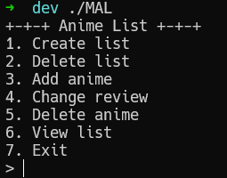
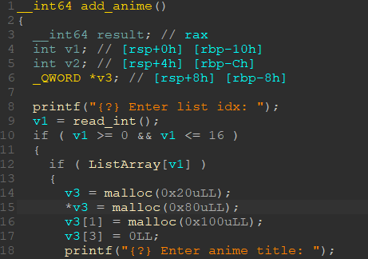
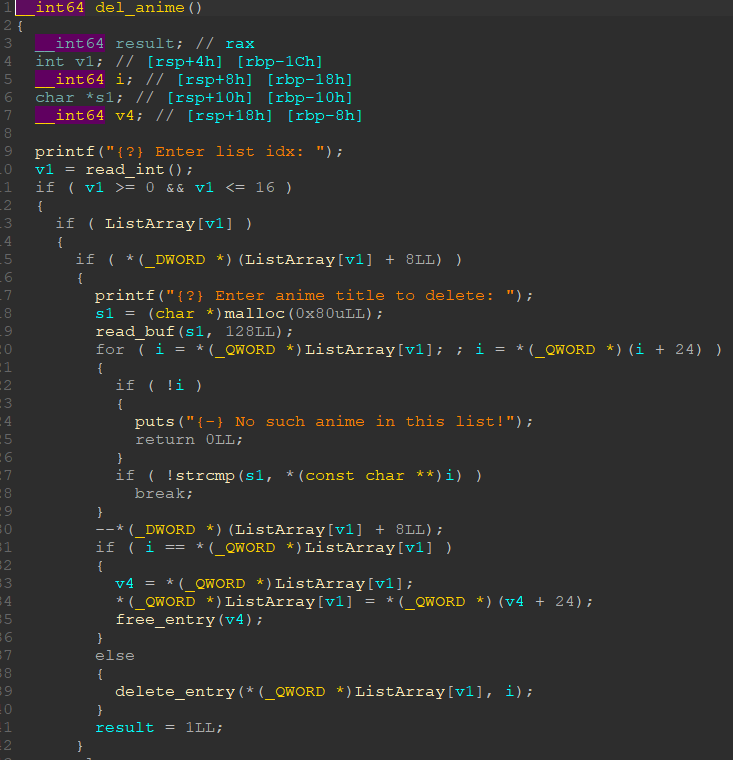
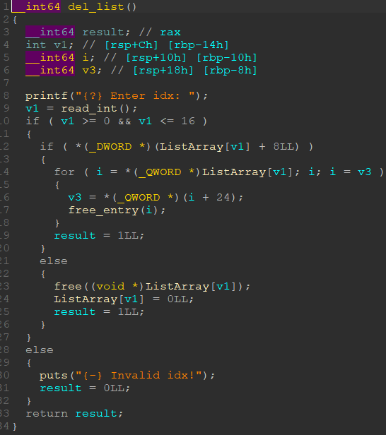
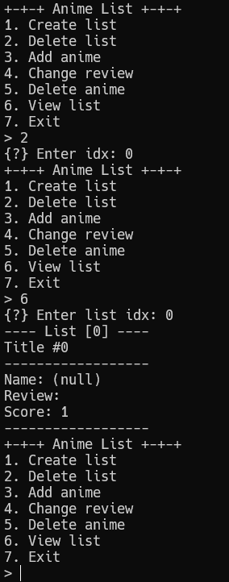
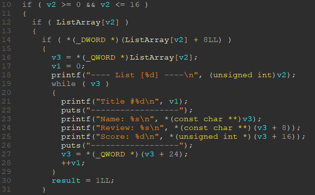
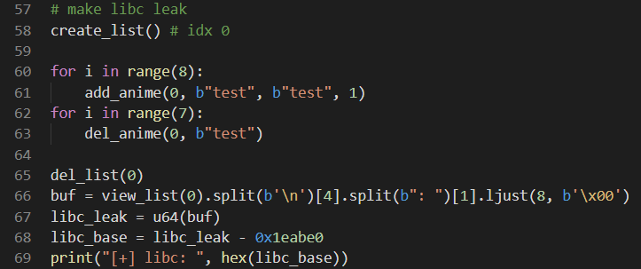
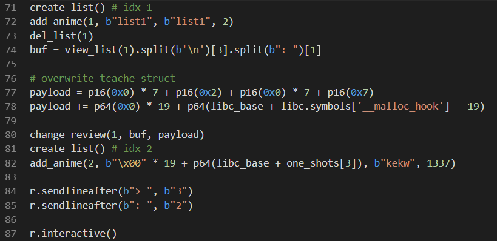
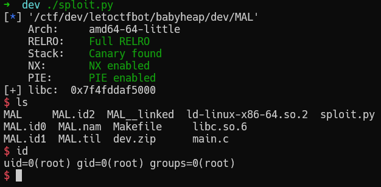

# LetoCTF Taskbot 2021 | my-anime-list

## Описание

> **my-anime-list**
> 
> Как известно, у каждого поклонника аниме есть свой список любимых тайтлов. Обычно он достаточно большой и его сложно запомнить целиком, поэтому мы написали специальную программу для его хранения. Если вы тоже поклонник аниме и хотите сохранить свои тайтлы, можете ей воспользоваться.
> 
> `nc HOST 17173`

## Файлы

- [my-anime-list.zip](static/my-anime-list.zip)

## Решение 

Нам дам исполняемый файл, загрузчик и libc. Запустив всё это можно увидеть довольно стандартное меню для pwn-тасков.



У нас есть ряд примитивов для создания каких-то объектов. По логике работы всё выглядит довольно просто. Мы можем создавать списки и добавлять в них элементы (тайтлы). Удалять тайтлы из списка и удалять сами списки. А также просматривать списки и изменять рецензии.

Разбирать все функции и описывать их мы не будем, вместо этого сосредоточим внимание только на важных деталях. Первое на что нам надо обратить внимание это контроль размера создаваемых объектов, точнее его отсутствие. Мы не контролируем размер объектов, которые создаются.



Как можно заметить при добавлении нового аниме создаётся 3 чанка в динамической памяти (куче). Первый чанк служит объектом, который хранит в себе 2 указателя на имя и рецензию и ещё одно поле для оценки. Как можно заметить у нас есть чанки которые потенциально могут попасть в fastbin и unsorted bin, но изначально при освобождении они будут попадать в tcache, потому что в задаче используется libc 2.29. Отсутствие контроля размера несколько сужает наши возможности, но это не критично.

Следующий момент, на который нам надо обратить внимание это «очистка» или удаления тайтлов и списков.



Выше представлен код удаления аниме из списка. В целом это код удаления элемента из односвязного списка и это мало что нам даёт, потому что, по сути, мы теряем указатель на этот элемент и получается, что здесь всё безопасно.

Далее посмотрим на код удаления списка.



Здесь сразу можно увидеть ошибку, которая заключается в том, что при удалении списка мы не зануляем указатель на сам список и не убираем элементы из односвязного списка. Таким образом удаление списка производит просто освобождение всех объектов, которые в нём хранятся, но просматривать мы его всё ещё можем. С помощью этой ошибки мы можем получить утечку памяти, а также произвести остальную эксплуатацию.

Для начала просто проверим, что это работает: создадим список, добавим в него элемент и удалим список, после чего просмотрим его.



Имя и отзыв пустые, потому что при просмотре мы пытаемся разыменовать указатель.



Выше представлен код просмотра списка.

Теперь попробуем использовать это для получения адреса libc. Будем использовать одну из самых простых техник – помещение чанка в unsorted bin и чтение первых 8 байт.



Мы создаём список и заполняем его 8-ю элементами, после чего освобождаем 7 элементов и заполняем tcache, далее удаляем список и просматриваем список. Одни из объектов описывающих тайтл будет находится в fastbin и у него не будет перетёрт указатель на описание тайтла. А чанк с описанием попадёт в unsorted bin, потому что в tcache нет места, и мы получим утечку libc.

Следующим нашим шагом будет произвольная запись. Писать мы будем в место, где лежит __malloc_hook.



Для произвольной записи мы создаём ещё один список, добавляем в него одну запись и удаляем список. После этого мы получаем имя записи (оно будет выглядеть как адрес внутри кучи) и с помощью функции изменения отзыва переписываем структуру tcache таким образом, что устанавливаем в начале списка адрес на место рядом с __malloc_hook и новый выделенный чанк будет расположен там. В новый чанк мы запишем 19 байт паддинга и адрес one_gadget-а для получения шелла.



[Вариант эксплойта](./sploit.py)

## Флаг

```
LetoCTF{0k_1_th1nk_1t_1s_n0t_MALw4r3}
```
